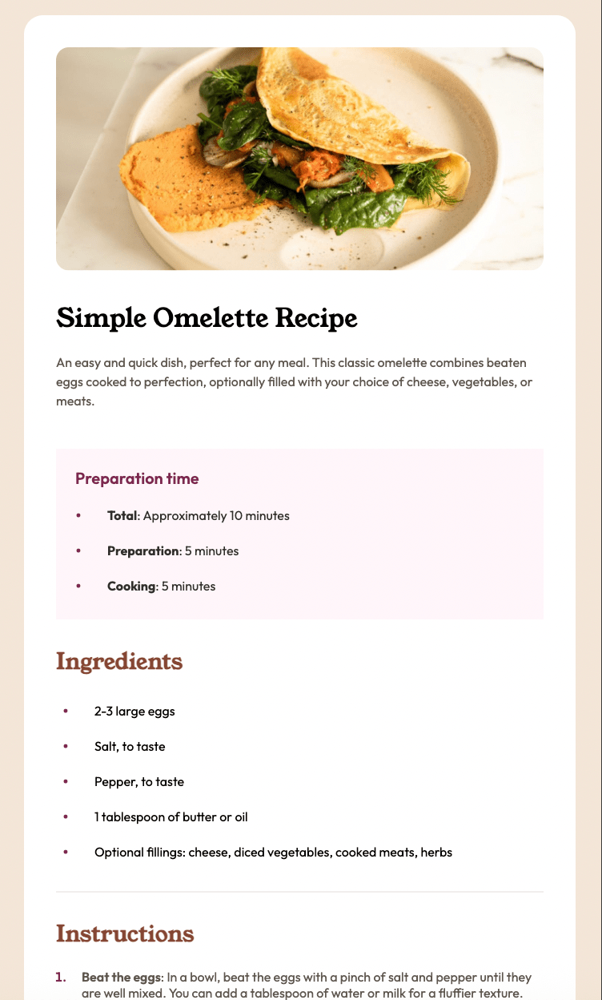

# recipe-page
This is my solution to the **Recipe Page** project on Frontend Mentor

## Live Demo
[View Live](https://anjelotin.github.io/recipe-page/)

## Technologies Used
- HTML
- CSS (Flexbox)
- Google Fonts [Outfit](https://fonts.google.com/specimen/Outfit)
- Google Fonts [Young Serif](https://fonts.google.com/specimen/Young+Serif)

## Screenshot

## What I learned

During this project I focused on"

- Practicing structuring HTML using semantic elements like `<main>`, `<article>`, and `<section>`.
- Using CSS flexbox for layout and responsivness.
- Use media query to alter layout and spacing on larger screen size. 